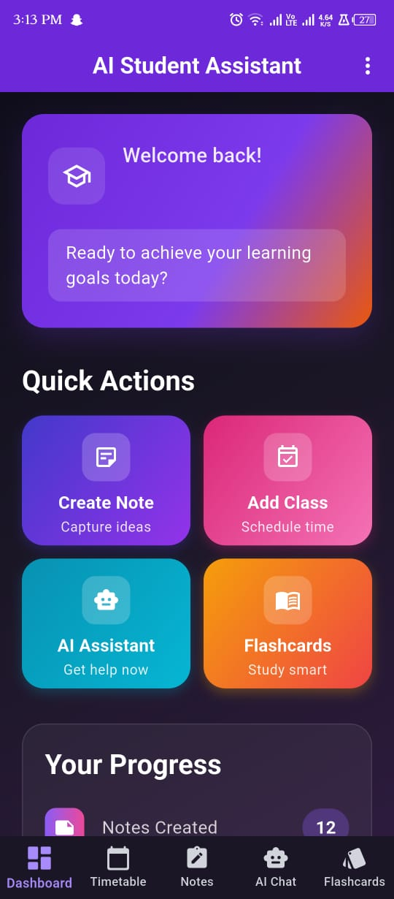
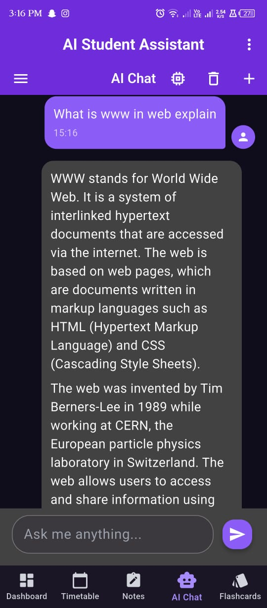
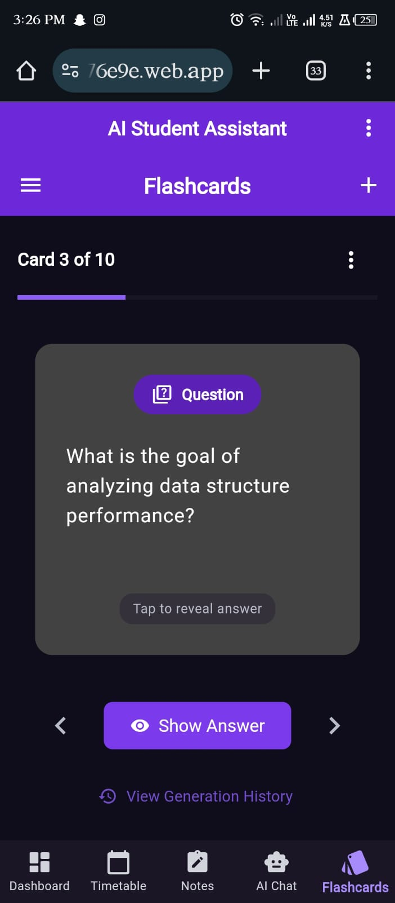
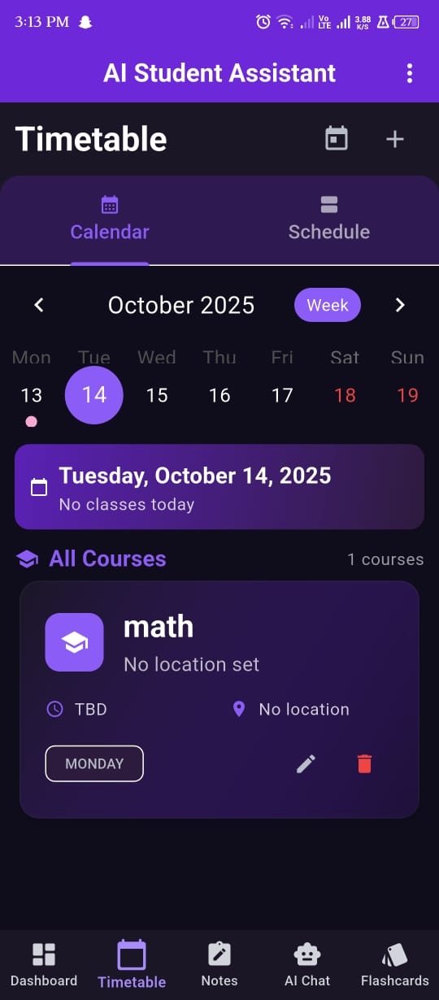
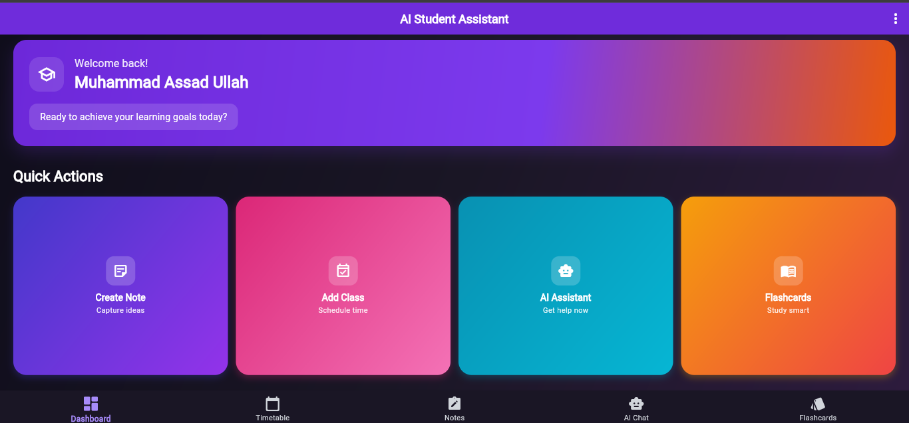

<div align="center">

# 🎓 AI Student Assistant

### *Intelligent Learning Companion for Modern Students*

[](https://flutter.dev)
[](https://firebase.google.com)
[](https://dart.dev)
[](LICENSE)

[](https://ai-student-assistant-76e9e.web.app)
[](build/app/outputs/flutter-apk/app-release.apk)

---

*A comprehensive Flutter application powered by AI for intelligent student assistance including timetable management, smart note-taking, conversational AI chat, and adaptive flashcard generation.*

</div>

## 📱 Screenshots

<table>
  <tr>
    <td align="center">
      
      <br><b>📊 Dashboard</b>
    </td>
    <td align="center">
      
      <br><b>🤖 AI Chat</b>
    </td>
    <td align="center">
      
      <br><b>🎯 Flashcards</b>
    </td>
    <td align="center">
      
      <br><b>📅 Timetable</b>
    </td>
  </tr>
</table>

<div align="center">
  
  <br><i>💻 Web Application Interface</i>
</div>

## ✨ Features

### 🎯 **Core Learning Tools**
- 🤖 **AI Chat Assistant** - Multi-model AI with 200 daily requests via smart key rotation
- 🎯 **Smart Flashcards** - AI-generated study cards from your notes and content
- 📚 **Course Management** - Organized timetable and comprehensive course tracking
- 📝 **Intelligent Notes** - AI-powered summarization and smart organization
- 🔍 **Semantic Search** - Find information across all your notes instantly

### 🔐 **Authentication & Security**
- 🔑 **Firebase Auth** - Email/Password + Google Sign-in integration
- 🔒 **Secure API Management** - Multi-key rotation system for reliability
- 👤 **User Profiles** - Personalized learning experience

### 📱 **Platform & Performance**
- 🌐 **Cross-Platform** - Web, Android, and iOS support
- 📱 **Offline-First** - Works without internet, syncs when connected
- 💾 **Local Storage** - SQLite for reliable offline functionality
- 🔔 **Smart Notifications** - Reminders for classes and study sessions
- ⚡ **Real-time Sync** - Firebase Firestore for instant updates

## 🚀 Technology Stack

<div align="center">

| Frontend | Backend | AI/ML | Database |
|----------|---------|-------|----------|
|  |  |  |  |
|  |  |  |  |
|  |  |  |  |

</div>

### 🔧 **Architecture & Libraries**
- **State Management**: Riverpod for reactive state management
- **Navigation**: Go Router for declarative routing
- **HTTP Client**: Dio for API communications
- **Local Storage**: SQLite with Floor ORM
- **Notifications**: Flutter Local Notifications
- **Authentication**: Firebase Auth SDK

## 🚀 Quick Start

### 📋 Prerequisites

- **Flutter SDK** 3.24+ ([Install Guide](https://docs.flutter.dev/get-started/install))
- **Firebase CLI** ([Install Guide](https://firebase.google.com/docs/cli#install_the_firebase_cli))
- **Git** ([Download](https://git-scm.com/downloads))
- **4 Free OpenRouter API Keys** ([Sign up](https://openrouter.ai/))

### ⚡ Installation

1. **Clone the Repository**
   ```bash
   git clone https://github.com/assassinaj602/ai-student-assistant.git
   cd ai-student-assistant
   ```

2. **Install Dependencies**
   ```bash
   flutter pub get
   ```

3. **Environment Setup**
   ```bash
   # Copy environment template
   cp .env.template .env
   
   # Edit .env with your API keys (see setup guide below)
   ```

4. **Firebase Configuration**
   - Follow our [Firebase Setup Guide](FIREBASE_SETUP_GUIDE.md)
   - Add your `google-services.json` (Android) and `GoogleService-Info.plist` (iOS)

5. **Run the App**
   ```bash
   # Web
   flutter run -d chrome
   
   # Android
   flutter run -d android
   
   # iOS  
   flutter run -d ios
   ```

### 🔑 API Keys Setup

1. **Create 4 Free OpenRouter Accounts**
   - Visit [OpenRouter.ai](https://openrouter.ai/)
   - Use different email addresses for each account
   - Get your free API key from each account (50 requests/day each = **200 total**)

2. **Configure Environment Variables**
   ```bash
   # Edit .env file
   OPENROUTER_API_KEY_1=sk-or-v1-your-first-key-here
   OPENROUTER_API_KEY_2=sk-or-v1-your-second-key-here
   OPENROUTER_API_KEY_3=sk-or-v1-your-third-key-here
   OPENROUTER_API_KEY_4=sk-or-v1-your-fourth-key-here
   ```

3. **Smart Key Rotation System**
   - Automatic rotation every 45 requests
   - Instant failover on rate limits
   - Debug logging for monitoring

## 🏗️ Build & Deploy

### 📱 **Mobile Apps**
```bash
# Android APK
flutter build apk --release \
  --dart-define=OPENROUTER_API_KEY_1=$OPENROUTER_API_KEY_1 \
  --dart-define=OPENROUTER_API_KEY_2=$OPENROUTER_API_KEY_2 \
  --dart-define=OPENROUTER_API_KEY_3=$OPENROUTER_API_KEY_3 \
  --dart-define=OPENROUTER_API_KEY_4=$OPENROUTER_API_KEY_4

# iOS (requires macOS)
flutter build ios --release
```

### 🌐 **Web Application**
```bash
# Build for web
flutter build web --release \
  --dart-define=OPENROUTER_API_KEY_1=$OPENROUTER_API_KEY_1 \
  --dart-define=OPENROUTER_API_KEY_2=$OPENROUTER_API_KEY_2 \
  --dart-define=OPENROUTER_API_KEY_3=$OPENROUTER_API_KEY_3 \
  --dart-define=OPENROUTER_API_KEY_4=$OPENROUTER_API_KEY_4

# Deploy to Firebase
firebase deploy --only hosting
```

## 📚 Documentation

| Document | Description |
|----------|-------------|
| [🔧 Setup Guide](SETUP.md) | Complete setup and installation instructions |
| [🔥 Firebase Guide](FIREBASE_SETUP_GUIDE.md) | Firebase configuration and deployment |
| [🔒 Security Guide](SECURITY_CHECKLIST.md) | API security and best practices |
| [🧪 Testing Guide](ATTENDANCE_TESTING_GUIDE.md) | Testing procedures and validation |
| [📋 Contributing](CONTRIBUTING.md) | How to contribute to this project |
| [📝 Changelog](CHANGELOG.md) | Version history and updates |

## 🎯 Usage Examples

### 💬 **AI Chat Interaction**
```dart
// Example: Getting study help from AI
final chatService = ref.read(chatServiceProvider);
final response = await chatService.sendMessage(
  "Explain quantum physics in simple terms"
);
```

### 🎯 **Generate Flashcards**
```dart
// Example: Creating flashcards from notes
final flashcardService = ref.read(flashcardServiceProvider);
final flashcards = await flashcardService.generateFromText(
  "Your study notes content here"
);
```

## 🤝 Contributing

We love contributions! Please see our [Contributing Guide](CONTRIBUTING.md) for details.

### 🚀 **Quick Contribute**
1. Fork the repository
2. Create your feature branch (`git checkout -b feature/AmazingFeature`)
3. Commit your changes (`git commit -m 'Add some AmazingFeature'`)
4. Push to the branch (`git push origin feature/AmazingFeature`)
5. Open a Pull Request

### 🐛 **Found a Bug?**
- Check [existing issues](https://github.com/assassinaj602/ai-student-assistant/issues)
- Create a [new issue](https://github.com/assassinaj602/ai-student-assistant/issues/new/choose) with our templates

## 📊 Project Status

<div align="center">


</div>

## 🌟 Features Roadmap

- [ ] 📊 **Analytics Dashboard** - Learning progress and statistics
- [ ] 🎨 **Theme Customization** - Dark/light themes and color schemes  
- [ ] 🌍 **Multi-language** - Internationalization support
- [ ] 📱 **Desktop Apps** - Windows, macOS, and Linux support
- [ ] 🔗 **Integration APIs** - Google Calendar, Notion, etc.
- [ ] 🎯 **Advanced AI** - Custom model fine-tuning
- [ ] 👥 **Study Groups** - Collaborative learning features

## 📄 License

This project is licensed under the MIT License - see the [LICENSE](LICENSE) file for details.

## 🙏 Acknowledgments

- **Flutter Team** for the amazing cross-platform framework
- **Firebase** for backend infrastructure and hosting
- **OpenRouter** for AI model access and API services
- **Riverpod** for state management solution
- **Open Source Community** for inspiration and tools

## 📞 Support & Contact

<div align="center">

[](https://github.com/assassinaj602/ai-student-assistant/issues)
[](https://ai-student-assistant-76e9e.web.app)

**Created with ❤️ for students everywhere**

</div>

---

<div align="center">

**⭐ Star this repository if it helped you! ⭐**

*Made with Flutter 💙*

</div>
- `FIREBASE_SERVICE_ACCOUNT_KEY`: Path to Firebase Admin JSON (e.g., ./config/firebase-service-account-key.json)
- `HUGGING_FACE_API_KEY`: Your Hugging Face API token
- `CORS_ORIGINS`: Comma-separated origins for your Flutter web dev URL(s), e.g., `http://localhost:5000`
- Optional daily limits: `DAILY_CHAT_LIMIT`, `DAILY_SUMMARIZE_LIMIT`, `DAILY_EMBEDDINGS_LIMIT`, `DAILY_FLASHCARDS_LIMIT`

### 3. Firebase Setup
1. Create a Firebase project at https://console.firebase.google.com/
2. Enable Authentication (Email/Password + Google)
3. Enable Firestore Database
4. Download configuration files:
   - Android: `google-services.json` → `android/app/`
   - iOS: `GoogleService-Info.plist` → `ios/Runner/`

### 4. Install FlutterFire CLI and Configure
```bash
dart pub global activate flutterfire_cli
flutterfire configure
```

### 5. Install Dependencies

**Flutter:**
```bash
flutter pub get
```

**Backend:**
```bash
cd backend
npm install
```

### 6. Run the Application

**Start Backend Server:**
```bash
cd backend
npm run dev # or: npm start
# Server runs on http://localhost:3000
```

**Run Flutter App:**
```bash
# Web (Chrome)
flutter run -d chrome --dart-define=API_BASE_URL=http://localhost:3000

# Android emulator
flutter run -d emulator-5554 --dart-define=API_BASE_URL=http://10.0.2.2:3000

# Physical device (replace with your LAN IP)
flutter run --dart-define=API_BASE_URL=http://192.168.1.100:3000
```

Notes:
- If you omit `API_BASE_URL`, the app will pick a platform-aware default (web/desktop: http://localhost:3000, Android emulator: http://10.0.2.2:3000).
- For Flutter web, ensure `CORS_ORIGINS` in backend `.env` includes your dev URL (e.g., http://localhost:5000).

## Environment Configuration

### Required API Keys
- **Hugging Face API Key**: Get from https://huggingface.co/settings/tokens
- **Firebase Service Account**: Firebase Console → Project Settings → Service Accounts → Generate new private key

### Default AI Models
- Chat: `microsoft/DialoGPT-medium`
- Summarization: `facebook/bart-large-cnn`
- Embeddings: `sentence-transformers/all-MiniLM-L6-v2`

## API Usage Limits
- Free tier: 20 AI calls per user per day
- Configurable via `AI_DAILY_QUOTA` environment variable

## Project Structure
```
ai_student_assistant/
├── lib/                     # Flutter source code
│   ├── main.dart           # App entry point
│   └── src/
│       ├── app.dart        # Main app widget
│       ├── theme.dart      # App theme configuration
│       ├── screens/        # UI screens
│       ├── providers/      # Riverpod providers
│       ├── services/       # Business logic services
│       └── models/         # Data models
├── backend/                # Node.js backend
│   ├── src/server.js       # Express server
│   ├── routes/             # API routes
│   └── middleware/         # Auth middleware
├── test/                   # Flutter tests
└── .github/workflows/      # CI/CD configuration
```

## Development

### Running Tests
```bash
flutter test
flutter test test/widget_test.dart
```

### Code Analysis
```bash
flutter analyze
```

### Build for Production
```bash
# Android
flutter build apk --release

# iOS
flutter build ios --release

# Web
flutter build web --release
```

## Troubleshooting

1. **Firebase Configuration Issues**: Ensure `flutterfire configure` was run successfully
2. **Backend Connection**: Check that proxy server is running on the expected port and `API_BASE_URL` matches
3. **API Rate Limits**: Monitor daily quota usage in app settings
4. **Offline Sync**: Check internet connectivity and Firebase rules

5. **Web CORS**: If you see CORS errors in the browser, update `CORS_ORIGINS` in `backend/.env` to include your dev origin, e.g., `http://localhost:5000`
6. **Authorized Domains (Web Auth)**: In Firebase Console → Authentication → Settings → Authorized domains, add `localhost` and `127.0.0.1` (and custom dev ports if prompted)

## Contributing

1. Fork the repository
2. Create a feature branch
3. Make your changes
4. Run tests: `flutter test`
5. Submit a pull request

## License

MIT License - see LICENSE file for details
